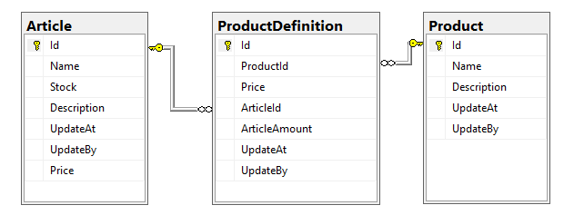

# Warehouse application

A simple application for warehouse. The backend is a .net core RESTful API and frontend is an AngularJS app.
## Start application

- install [Docker Compose](https://docs.docker.com/compose/install/);
- run `docker-compose up -d` in the root of the application folder, where `docker-compose.yml` is located; 
- backend api **documentation**: [http://localhost:8080](http://localhost:8080/);
- backend api basic **healthcheck** endpoint: [http://localhost:8080/health](http://localhost:8080/health);
- frontend ui: [http://localhost:80](http://localhost:80/); NB: for demo purpose, the frontend only consumes only few backend endpoints;
- mssql database: [127.0.0.1,1433](127.0.0.1,1433). demo credentials are in the docker-compose.yml;

## Project file structure

| Folder/File                                   | Description |
| -------------                                 |:-------------:|
| warehouse-api                                 | contains all the source code for backend api |
| warehouse-api/src/Warehouse.API               | .net core webapi application |
| warehouse-api/src/Warehouse.Entities          | entity/database design |
| warehouse-api/src/Warehouse.Entities          | entity/database design |
| warehouse-api/src/Warehouse.Services          | warehouse services |
| warehouse-api/tests/Warehouse.ServiceTests    | unit tests for warehouse services |
| warehouse-ui                                  | contains all the source code for frontend angular app |
| docker-compose.yml                            | bring up api and mssql as docker containers |
| dockerfiles                                   | dockerfiles, env and db init script |
| dockerfiles/api.Dockerfile                    | api docker file |
| dockerfiles/demo.env                          | env for api server |
| dockerfiles/mssql.Dockerfile                  | mssql server dockerfile |
| dockerfiles/db                                | mssql init script |


## Backend endpoint brief description
| Endpoint | HttpMethod| Description|
| ------------- | ------------- |:-------------:|
| /api/Inventory | GET | get all articles|
| /api/Inventory/{id} | GET | get one article|
| /api/Inventory | POST | add a new article|
| /api/Inventory/upload | POST | add articles vai file (json) upload |
| /api/Inventory/{id} | PUT | update an article|
| /api/Products | GET | get all products |
| /api/Products/{id} | GET | get one product |
| /api/Products | POST | add a new product |
| /api/Products/{id} | PUT | update a product |
| /api/Products/{id} | DELETE | delete a product |
| /api/Products | POST | add a new product |
| /api/Products/sell | POST | sell a product and update inventory/article |
| /api/Products/upload | POST | add products via file (json) upload |
| /api/Products/stocks | GET | get stock info for all product |
| /api/Products/stocks/{id} | GET | get a product stock info |

## Frontend brief description
| Page | Description|
| ------------- |:-------------:|
| [http://localhost/inventory](http://localhost/inventory) | list of all inventory articles |
| [http://localhost/inventory/upload](http://localhost/inventory/upload) | add inventory articles via json file upload |
| [http://localhost/products](http://localhost/products) | list of all products |
| [http://localhost/products/stock](http://localhost/products/stock) | list of the stock details for all products |
| [http://localhost/products/upload](http://localhost/products/upload) | add products via json file upload |

## Database design



## File upload specification
- you can upload a json file containing the articles via [http://localhost:8080/api/Inventory/upload](http://localhost:8080/api/Inventory/upload). The json file is expected to have the following structure: 


```json
{
  "inventory": [
    {
      "art_id": "1",
      "name": "leg",
      "stock": "12"
    },
    {
      "art_id": "2",
      "name": "screw",
      "stock": "17"
    },
    {
      "art_id": "3",
      "name": "seat",
      "stock": "2"
    },
    {
      "art_id": "4",
      "name": "table top",
      "stock": "1"
    }
  ]
}
````

- you can upload a json file containing the products via [http://localhost:8080/api/Products/upload](http://localhost:8080/api/Products/upload). The json file is expected to have the following structure (all the articles in the product must be predefind in warehouse): 

```json
{
  "products": [
    {
      "name": "Dining Chair",
      "contain_articles": [
        {
          "art_id": "1",
          "amount_of": "4"
        },
        {
          "art_id": "2",
          "amount_of": "8"
        },
        {
          "art_id": "3",
          "amount_of": "1"
        }
      ]
    },
    {
      "name": "Dinning Table",
      "contain_articles": [
        {
          "art_id": "1",
          "amount_of": "4"
        },
        {
          "art_id": "2",
          "amount_of": "8"
        },
        {
          "art_id": "4",
          "amount_of": "1"
        }
      ]
    }
  ]
}

```

## Branches
- `main`: contains everything
- `develop`: the develop branch; all the feature branches will be merged to the develop branch;
- `test`, `acc` and `prod`: follows the order `test` => `acc` => `prod`;

## Versions:
the `prod` branch has the version tags.


## Discussion points

#### serverless or monolithic
- why not choose `serverless`? it is possible (also be open to this option) that the application can be written using aws lambdas or azure functions. The major reasons not to choose the serverless design at this moment are: 1) warehouse is at this moment relatively simple, chosing serverless is bit overkill; 2) simplicity for ops and code base; 
- why not choose `monolithic`? while warehouse is relatively simple at this moment.The functionalities can grow very fast and the user base can also very large. It is also possible that we could have mutiple client applications (web front end, mobile apps etc);

#### application design
- this application focuses on the backend API (RESTful api);
- if time allows, build a frontend web application using (Angular, REACT or vue) will be ideal;

#### SQL vs NON-SQL
SQL database is chosen over non-sql with the assumption that the application is written heavy.

#### deployment && scalability
the application is dockerized and can be deployed as containers using popular cloud providers or kubernetes clusters;


#### future improvement
- authentication /authorization: at this moment there is no authentication / authorization directly handled in the application. This is based on the assumption there will be a centrilized authentication /authorization layer, like api gateway layer, that is handling them via token or certs. 

- prepare the CI/CD pipeline using Github actions, Jenkins/Ansible etc.

- parepare the infra as code if needed.

- logs and performance monitoring;

- more backend and frontend (unit) tests (I would like to take the TDD approach if with enough time).

